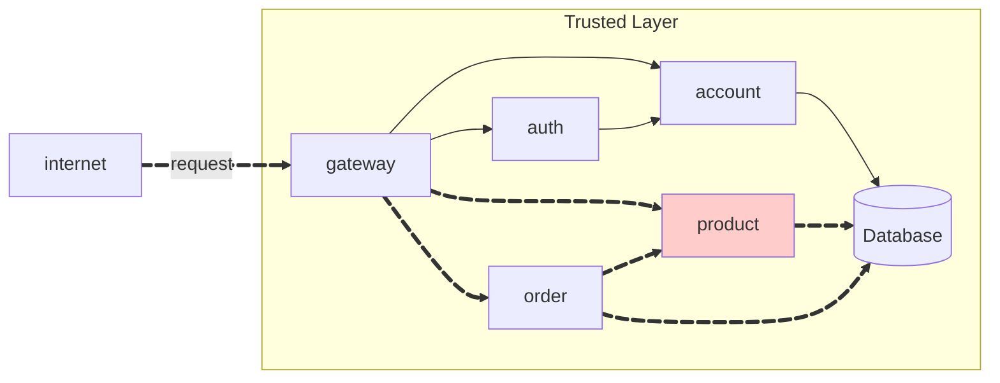
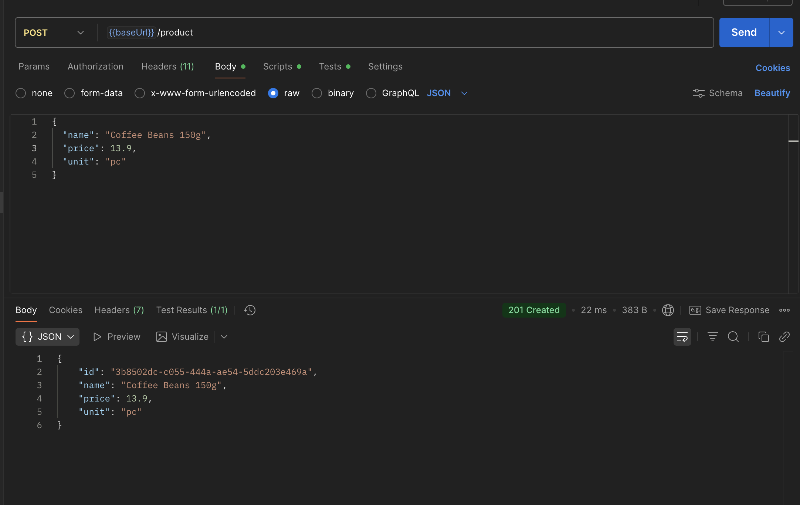
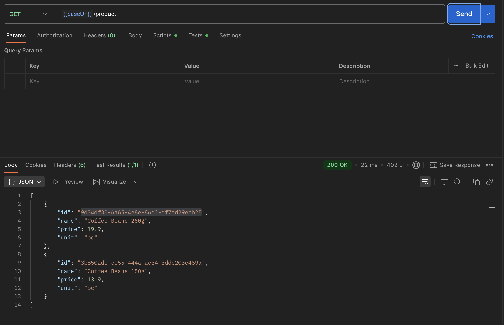
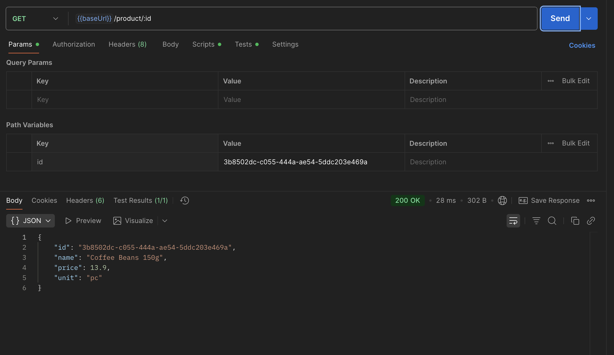
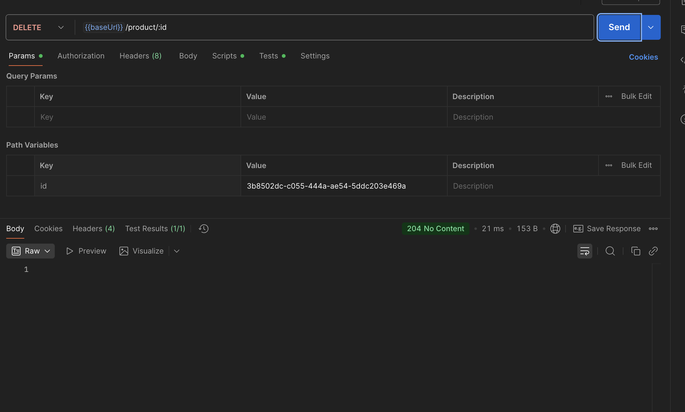

# Exercício 1 - Product API



## Repositórios

### 1. Product Repository
**Link:** [https://github.com/vitorraiaa/pma252.product.git](https://github.com/vitorraiaa/pma252.product.git)

**Estrutura do projeto:**
```bash
product/
├── src/main/java/store/product/
│   ├── ProductController.java
│   ├── ProductIn.java
│   └── ProductOut.java
├── pom.xml
├── Jenkinsfile
└── .gitignore

```

### 2. Product Service Repository
**Link:** [https://github.com/vitorraiaa/pma252.product-service.git](https://github.com/vitorraiaa/pma252.product-service.git)

**Descrição:** Repositório contendo a implementação completa do microserviço de produtos com Spring Boot.

**Estrutura do projeto:**
```bash
product-service/
├── src/main/
│   ├── Product.java
│   ├── ProductApplication.java
│   ├── ProductModel.java
│   ├── ProductParser.java
│   ├── ProductRepository.java
│   ├── ProductResource.java
│   └── ProductService.java
├── DockerFile
├── Jenkinsfile
├── pom.xml
└── .gitignore
```

## Código Fonte das Atividades

### Principais Componentes Implementados

#### 1. ProductController.java
Controlador REST responsável por expor os endpoints da API de produtos:

```java
@FeignClient(name = "product", url = "http://product:8080")
public interface ProductController {
    
    @PostMapping("/product")
    public ResponseEntity<ProductOut> create(
        @RequestBody ProductIn in
    );

    @GetMapping("/product/{id}")
    public ResponseEntity<ProductOut> findById(
        @PathVariable("id") String id
    );

    @GetMapping("/product")
    public ResponseEntity<List<ProductOut>> findAll();

    @DeleteMapping("/product/{id}")
    public ResponseEntity<Void> delete(
        @PathVariable("id") String id
    );

}
```

#### 2. Product.java (Entidade)
Entidade JPA representando um produto no banco de dados:

```java
@Builder @Data @Accessors(fluent = true, chain = true)
public class Product {
    String id;
    String name;
    Double price;
    String unit;
}
````

#### 3. ProductService.java
Camada de serviço contendo a lógica de negócio:

```java
@Service
public class ProductService {

    @Autowired
    private ProductRepository productRepository;

    public Product create(Product product) {
        if (null == product.name()) {
            throw new ResponseStatusException(HttpStatus.BAD_REQUEST,
                "Name is mandatory!"
            );
        }
        if (null == product.price()) {
            throw new ResponseStatusException(HttpStatus.BAD_REQUEST,
                "Price is mandatory!"
            );
        }

        if (productRepository.findByName(product.name()) != null)
            throw new ResponseStatusException(HttpStatus.BAD_REQUEST,
                "Name already have been registered!"
            );
        return productRepository.save(
            new ProductModel(product)
        ).to();
    }

    public List<Product> findAll() {
        return StreamSupport.stream(
            productRepository.findAll().spliterator(), false)
            .map(ProductModel::to)
            .toList();
    }    

    public Product findById(String id) {
        return productRepository.findById(id)
            .map(ProductModel::to)
            .orElseThrow(() -> new ResponseStatusException(
                HttpStatus.NOT_FOUND, "Product not found"
            ));
    }

    public void delete(String id) {
        if (!productRepository.existsById(id)) {
            throw new ResponseStatusException(
                HttpStatus.NOT_FOUND, "Product not found"
            );
        }
        productRepository.deleteById(id);
    }
}
```

## Product API

The API should have the following endpoints:

!!! info "POST /product"

    Create a new product.

    === "Request"

        ``` { .json .copy .select linenums='1' }
        {
            "name": "Coffee Beans 250g",
            "price": 19.9,
            "unit": "pc"
        }
        ```

    === "Response"

        ``` { .json .copy .select linenums='1' }
        {
            "id": "9d34df30-6a65-4e8e-86d3-df7ad29ebb25",
            "name": "Coffee Beans 250g",
            "price": 19.9,
            "unit": "pc"
        }
        ```
        ```bash
        Response code: 201 (created)
        ```
    === "Postman"
        { width=100% }

!!! info "GET /product"

    Get all products.

    === "Response"

        ``` { .json .copy .select linenums='1' }
        [
            {
                "id": "9d34df30-6a65-4e8e-86d3-df7ad29ebb25",
                "name": "Coffee Beans 250g",
                "price": 19.9,
                "unit": "pc"
            },
            {
                "id": "3b8502dc-c055-444a-ae54-5ddc203e469a",
                "name": "Coffee Beans 150g",
                "price": 13.9,
                "unit": "pc"
            }
        ]
        ```
        ```bash
        Response code: 200 (ok)
        ```
    === "Postman"
        { width=100% }

!!! info "GET /product/{id}"

    Get a product by its ID.

    === "Response"

        ``` { .json .copy .select linenums='1' }
        {
            "id": "3b8502dc-c055-444a-ae54-5ddc203e469a",
            "name": "Coffee Beans 150g",
            "price": 13.9,
            "unit": "pc"
        }
        ```
        ```bash
        Response code: 200 (ok)
        ```
    === "Postman"
        { width=100% }

!!! info "DELETE /product/{id}"

    Delete a product by its ID.

    ```bash
    Response code: 204 (no content)
    ```

    === "Postman"
        { width=100% }
---

> This MkDocs was created by [Vitor Raia](https://github.com/vitorraiaa)