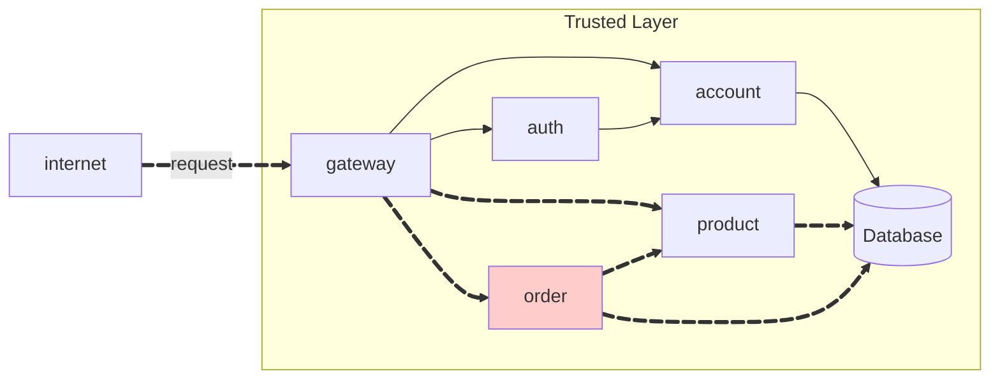
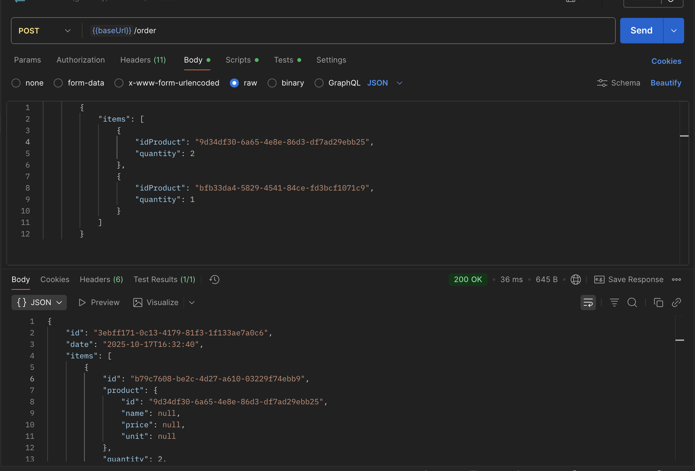
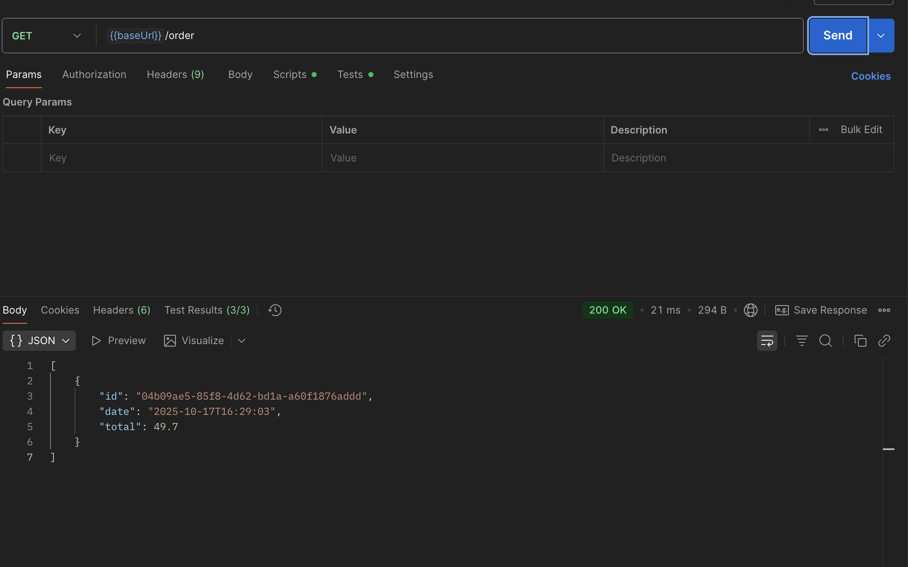
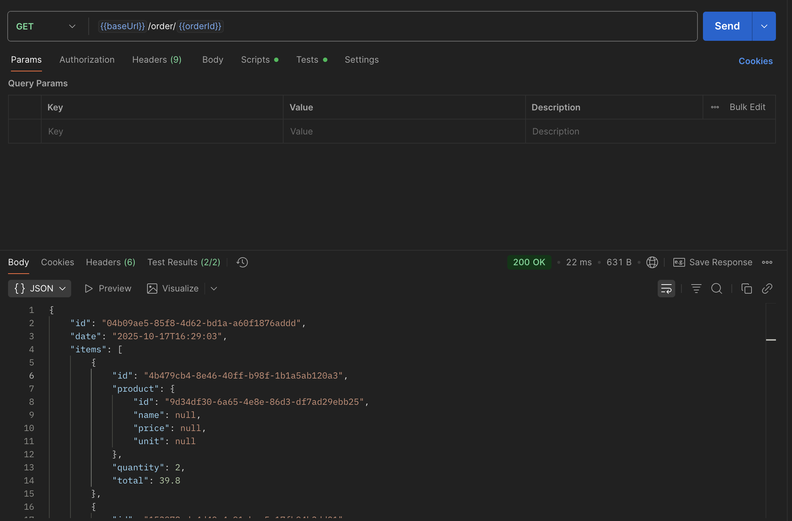

# Exercício 2 - Order API



## Repositórios

### 1. Order Repository
**Link:** [https://github.com/vitorraiaa/pma252.order.git](https://github.com/vitorraiaa/pma252.order.git)

**Estrutura do projeto:**

```bash
order/
├── src/main/java/store/order/
│   ├── OrderController.java
│   ├── OrderIn.java
│   ├── OrderItemIn.java
│   ├── OrderItemOut.java
│   ├── OrderSummary.java
│   └── OrderOut.java
├── pom.xml
├── Jenkinsfile
└── .gitignore
```

### 2. Order Service Repository
**Link:** [https://github.com/vitorraiaa/pma252.order-service.git](https://github.com/vitorraiaa/pma252.order-service.git)

**Descrição:** Repositório contendo a implementação completa do microserviço de pedidos com Spring Boot.

**Estrutura do projeto:**
```bash
order-service/
├── src/main/
│   ├── FeignAuth.java
│   ├── Order.java
│   ├── OrderApplication.java
│   ├── OrderItem.java
│   ├── OrderItemModel.java
│   ├── OrderItemParser.java
│   ├── OrderItemRepository.java
│   ├── OrderModel.java
│   ├── OrderParser.java
│   ├── OrderRepository.java
│   ├── OrderResource.java
│   └── OrderService.java
├── DockerFile
├── Jenkinsfile
├── pom.xml
└── .gitignore
```

## Código Fonte das Atividades

### Principais Componentes Implementados

### Principais Componentes Implementados

#### 1. OrderController.java
Controlador REST responsável por expor os endpoints da API de pedidos:

```java
@FeignClient(name = "order", url = "http://order:8080")
public interface OrderController {

    @PostMapping("/order")
    ResponseEntity<OrderOut> create(@RequestBody OrderIn in);

    @GetMapping("/order")
    ResponseEntity<List<OrderOut>> findAll();

    @GetMapping("/order/{id}")
    ResponseEntity<OrderOut> findById(@PathVariable("id") String id);
}
```

#### 2. Order.java (Entidade)
Entidade JPA representando um pedido no banco de dados:

```java
@Data
@Builder(toBuilder = true)
@Accessors(fluent = true, chain = true)
@EqualsAndHashCode(of = "id")
@ToString(onlyExplicitlyIncluded = true)
public class Order implements Serializable {
    private static final long serialVersionUID = 1L;

    @ToString.Include
    private String id;

    @ToString.Include
    private String idUser;

    @ToString.Include
    private Date date;

    @ToString.Include
    private Double total;

    private List<OrderItem> items;
}

```

#### 3. OrderService.java
Camada de serviço contendo a lógica de negócio para pedidos:

```java
@Service
@RequiredArgsConstructor
public class OrderService {

    private final OrderRepository orderRepository;
    private final ProductController productController;

    @Cacheable(value = "orders", key = "#idOrder + '-' + #userId")
    @Transactional(readOnly = true)
    public Order findByIdOrder(String idOrder, String userId) {
        OrderModel model = orderRepository.findByIdOrderAndIdUser(idOrder, userId);
        return model == null ? null : model.to();
    }

    @Transactional(readOnly = true)
    public List<Order> findAllByUser(String userId) {
        return orderRepository.findAllByIdUser(userId)
                              .stream()
                              .map(OrderModel::to)
                              .toList();
    }

    @Transactional
    public Order create(Order order) {
        order.date(new Date());


        if (order.items() != null) {
            for (OrderItem i : order.items()) {
                i.price(fetchPrice(i.productId()));
            }
        }

        order.total(calculateTotal(order.items()));


        OrderModel saved = orderRepository.save(new OrderModel(order));
        return saved.to();
    }

    @Transactional
    public Order update(Order order) {
        OrderModel existing = orderRepository
                .findByIdOrderAndIdUser(order.id(), order.idUser());

        if (existing == null) return null;

        existing.date(new Date());
        existing.total(calculateTotal(order.items()));

        existing.items().clear();
        persistItems(order.items(), existing);

        orderRepository.save(existing);
        return existing.to();
    }

    @Transactional
    public void delete(String idOrder, String userId) {
        OrderModel existing = orderRepository.findByIdOrderAndIdUser(idOrder, userId);
        if (existing != null) orderRepository.delete(existing);
    }

    private void persistItems(List<OrderItem> items, OrderModel order) {
        if (items == null) return;

        for (OrderItem i : items) {
            i.price(fetchPrice(i.productId()));      
            OrderItemModel im = new OrderItemModel(i, order);
            order.items().add(im);
        }
    }

    private Double calculateTotal(List<OrderItem> items) {
        if (items == null) return 0.0;
        return items.stream()
                    .mapToDouble(i -> fetchPrice(i.productId()) * i.quantity())
                    .sum();
    }

    private Double fetchPrice(String productId) {
        ProductOut product = productController.findById(productId).getBody();
        return product != null ? product.price() : 0.0;
    }
}
```


## Order API

!!! info "POST /order"

    Create a new order **for the current user**.

    === "Request"

        ``` { .json .copy .select linenums='1' }
        {
            "items": [
                {
                    "idProduct": "9d34df30-6a65-4e8e-86d3-df7ad29ebb25",
                    "quantity": 2
                },
                {
                    "idProduct": "bfb33da4-5829-4541-84ce-fd3bcf1071c9",
                    "quantity": 1
                }
            ]
        }
        ```

    === "Response"

        ``` { .json .copy .select linenums='1' }
        {
            "id": "04b09ae5-85f8-4d62-bd1a-a60f1876addd",
            "date": "2025-10-17T16:29:03",
            "items": [
                {
                    "id": "4b479cb4-8e46-40ff-b98f-1b1a5ab120a3",
                    "product": {
                        "id": "9d34df30-6a65-4e8e-86d3-df7ad29ebb25",
                        "name": null,
                        "price": null,
                        "unit": null
                    },
                    "quantity": 2,
                    "total": 39.8
                },
                {
                    "id": "153978ed-4d40-4a91-bee5-17fb94b3dd01",
                    "product": {
                        "id": "bfb33da4-5829-4541-84ce-fd3bcf1071c9",
                        "name": null,
                        "price": null,
                        "unit": null
                    },
                    "quantity": 1,
                    "total": 9.9
                }
            ],
            "total": 49.699999999999996
    }

        ```
        ```bash
        Response code: 201 (created)
        Response code: 400 (bad request), if the product does not exist.
        ```

    === "Postman"
        { width=100% }

!!! info "GET /order"

    Get all orders **for the current user**.

    === "Response"

        ``` { .json .copy .select linenums='1' }

        [
            {
                "id": "04b09ae5-85f8-4d62-bd1a-a60f1876addd",
                "date": "2025-10-17T16:29:03",
                "total": 49.7
            }
        ]

        ```
        ```bash
        Response code: 200 (ok)
        ```
    === "Postman"
        { width=100% }

!!! info "GET /order/{id}"

    Get the order details by its ID. **The order must belong to the current user.**, otherwise, return a `404`.

    === "Response"

        ``` { .json .copy .select linenums='1' }
        {
            "id": "04b09ae5-85f8-4d62-bd1a-a60f1876addd",
            "date": "2025-10-17T16:29:03",
            "items": [
                {
                    "id": "4b479cb4-8e46-40ff-b98f-1b1a5ab120a3",
                    "product": {
                        "id": "9d34df30-6a65-4e8e-86d3-df7ad29ebb25",
                        "name": null,
                        "price": null,
                        "unit": null
                    },
                    "quantity": 2,
                    "total": 39.8
                },
                {
                    "id": "153978ed-4d40-4a91-bee5-17fb94b3dd01",
                    "product": {
                        "id": "bfb33da4-5829-4541-84ce-fd3bcf1071c9",
                        "name": null,
                        "price": null,
                        "unit": null
                    },
                    "quantity": 1,
                    "total": 9.9
                }
            ],
            "total": 49.7
        }
        ```
        ```bash
        Response code: 200 (ok)
        Response code: 404 (not found), if the order does not belong to the current user.
        ```

    === "Postman"
        { width=100% }


> This MkDocs was created by [Vitor Raia](https://github.com/vitorraiaa)