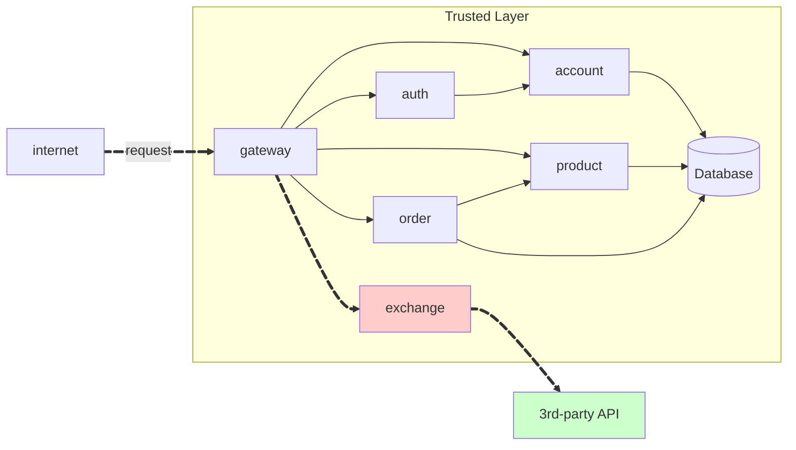
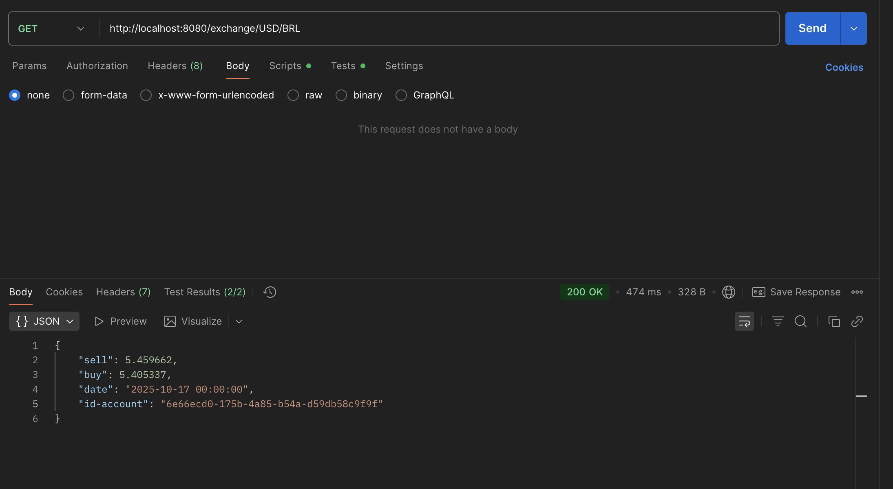
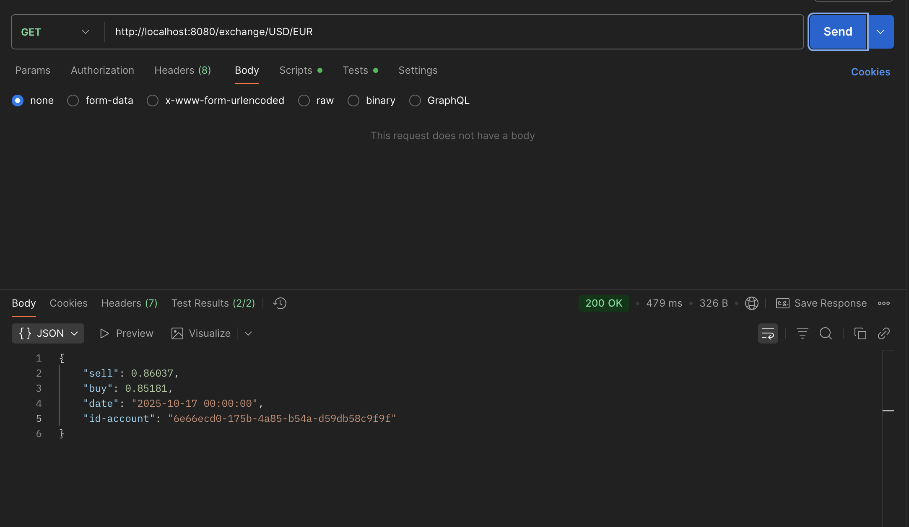

# Exercício 3 - API Exchange



## Repositórios Utilizados

### Exchange Repository
**Link:** [https://github.com/vitorraiaa/pma252.exchange.git](https://github.com/vitorraiaa/pma252.exchange.git)


**Estrutura do projeto:**
```bash
exchange/
├── app/
│   ├── config.py
│   └── main.py
├── requirements.txt
├── README.md
├── Dockerfile
└── .gitignore
```
## Código Fonte das Atividades

### Principais Componentes Implementados

#### 1. main.py (Aplicação FastAPI)
Aplicação principal implementada em Python com FastAPI:

```python
from datetime import datetime
from fastapi import FastAPI, Header, HTTPException
from fastapi.responses import JSONResponse
import requests
from .config import settings

app = FastAPI(title="Exchange Service", version="1.0.0")

# ---------------------- Utils ----------------------

def _require_identity(id_account: str | None, user_id: str | None) -> str:
    """
    O Gateway valida o JWT em /auth/solve e injeta os headers:
      - id-account: <uuid da conta>
      - User-Id: <uuid> (fallback para serviços legados)
    O serviço confia nesses headers (Trusted Layer).
    """
    identity = id_account or user_id
    if not identity:
        raise HTTPException(status_code=401, detail="Missing id-account header")
    return identity


def _fetch_rate(from_ccy: str, to_ccy: str) -> tuple[float, str]:
    """
    Busca taxa mid e data. Tenta exchangerate.host (/convert), com fallback em frankfurter.app.
    """
    base = from_ccy.upper()
    quote = to_ccy.upper()

    headers = {}
    if settings.PROVIDER_API_KEY and settings.PROVIDER_API_KEY_HEADER:
        headers[settings.PROVIDER_API_KEY_HEADER] = settings.PROVIDER_API_KEY

    # 1) exchangerate.host (convert)
    try:
        url = f"{settings.PROVIDER_BASE_URL}/convert"
        params = {"from": base, "to": quote}
        r = requests.get(url, params=params, headers=headers, timeout=10)
        r.raise_for_status()
        j = r.json()
        # formatos comuns:
        #  - {"success":true,"info":{"rate":0.91},"date":"2025-10-15", ...}
        #  - {"result":0.91,"date":"2025-10-15", ...}
        if "info" in j and isinstance(j["info"], dict) and "rate" in j["info"]:
            rate = float(j["info"]["rate"])
        elif "result" in j:
            rate = float(j["result"])
        else:
            raise ValueError("missing rate field")

        date_str = j.get("date") or datetime.utcnow().strftime("%Y-%m-%d")
        try:
            dt = (
                datetime.fromisoformat(date_str)
                if "T" in date_str else datetime.strptime(date_str, "%Y-%m-%d")
            )
        except Exception:
            dt = datetime.utcnow()
        return rate, dt.strftime("%Y-%m-%d %H:%M:%S")
    except Exception:
        # segue para fallback
        pass

    # 2) fallback: frankfurter.app (sem chave)
    try:
        url = "https://api.frankfurter.app/latest"
        params = {"from": base, "to": quote}
        r = requests.get(url, params=params, timeout=10)
        r.raise_for_status()
        j = r.json()
        # {"amount":1.0,"base":"USD","date":"2025-10-15","rates":{"EUR":0.91}}
        rates = j.get("rates") or {}
        if quote not in rates:
            raise ValueError("unsupported currency at fallback")
        rate = float(rates[quote])
        date_str = j.get("date") or datetime.utcnow().strftime("%Y-%m-%d")
        try:
            dt = (
                datetime.fromisoformat(date_str)
                if "T" in date_str else datetime.strptime(date_str, "%Y-%m-%d")
            )
        except Exception:
            dt = datetime.utcnow()
        return rate, dt.strftime("%Y-%m-%d %H:%M:%S")
    except Exception as e:
        raise HTTPException(status_code=502, detail=f"FX provider error: {e}")


def _apply_spread(mid_rate: float) -> tuple[float, float]:
    """
    Aplica spread total (bps) em torno da taxa mid.
      - sell: preço p/ VENDER a base → mid * (1 + s/2)
      - buy : preço p/ COMPRAR a base → mid * (1 - s/2)
    """
    s = settings.SPREAD_BPS / 10_000.0
    half = s / 2.0
    sell = round(mid_rate * (1.0 + half), 6)
    buy = round(mid_rate * (1.0 - half), 6)
    return sell, buy

# ---------------------- Rotas ----------------------

@app.get("/health")
async def health():
    return {"status": "ok"}

@app.get("/exchange/{from_ccy}/{to_ccy}")
async def get_exchange(
    from_ccy: str,
    to_ccy: str,
    id_account: str | None = Header(default=None, alias="id-account"),
    user_id: str | None = Header(default=None, alias="User-Id"),
):
    # 1) exige identidade (injetada pelo Gateway após login)
    account = _require_identity(id_account, user_id)

    # 2) taxa mid do provedor
    mid, date_str = _fetch_rate(from_ccy, to_ccy)

    # 3) aplica spread
    sell, buy = _apply_spread(mid)

    # 4) resposta
    return JSONResponse(
        status_code=200,
        content={
            "sell": sell,
            "buy": buy,
            "date": date_str,
            "id-account": account,
        },
    )

# Execução direta opcional (para testes locais sem gateway):
if __name__ == "__main__":
    import uvicorn
    uvicorn.run("app.main:app", host="0.0.0.0", port=8080, reload=False)
```

!!! info "GET /exchange/{from}/{to}"

    Get the current of a coin from one currency to another. E.g. `GET /coin/USD/EUR`.

    === "Response"

        ``` { .json .copy .select linenums='1' }
        {
            "sell": 0.86037,
            "buy": 0.85181,
            "date": "2025-10-17 00:00:00",
            "id-account": "6e66ecd0-175b-4a85-b54a-d59db58c9f9f"
        }
        ```

        ```bash
        Response code: 200 (ok)
        ```
    === "Postman BRL"
        { width=100% }
    === "Postman EUR"
        { width=100% }

> This MkDocs was created by [Vitor Raia](https://github.com/vitorraiaa)